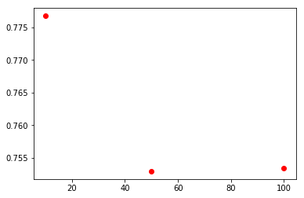
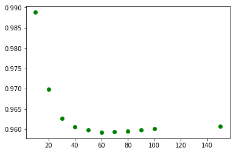
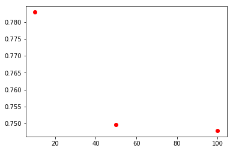
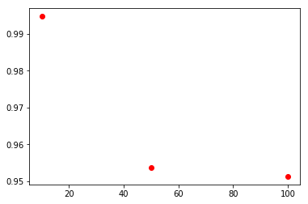
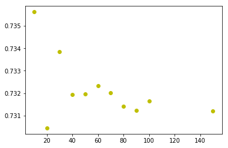
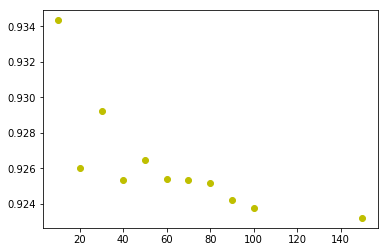

# Laboratorio 1


- **Fecha Inicio**: Miércoles 18 de abril del 2018
- **Entrega Informe**: Domingo 29 de abril del 2018

# Instalación

Para facilitar el proceso de instalación de esta actividad, trabajaremos con una máquina virtual que tendrá _casi_ todos los programas instalados.

Como motor de máquinas virtuales usaremos [Virtual Box](https://www.virtualbox.org/wiki/Downloads). Desde ese link tendrán que descargar la versión que mejor se ajuste a su sistema operativo. Luego desde los servidores de la universidad deben descargar la [máquina virtual](http://niebla.ing.puc.cl/diplomadobigdata/vbox-pyreclab-lda.ova) ya configurada.

Finalmente debemos importar la máquina descargada dentro de Virtual Box, para ello deben seguir los siguientes pasos: Abrir virtual box > Archivo > Abrir servicio virtualizado, o bien `Crtl+I`.

**Observación:** la contraseña del usuario configurado es _ubuntu_.

Una vez abierto la máquina virtual, abrir la consola o terminal y escribir los siguiente comandos:

```bash
$ sudo apt-get install git
$ sudo pip3 install jupyter
$ sudo pip3 install matplotlib
```

Descargar este proyecto ya sea con `git` o mediante el botón de descargar y ejecutar `notebook`.

```bash
$ git clone https://github.com/stgolarrain/recsys-labs.git
$ cd recsys-labs/assignment-1
$ jupyter notebook
```

## Instrucciones

En este laboratorio explorarán la herramienta de sistemas de recomendación pyreclab.

La biblioteca [pyreclab]( https://github.com/gasevi/pyreclab ) es una librería que implementa una serie de técnicas y modelos de recomandación, exponiendo una interfaz de fácil uso manteniendo un buen rendimiento en meoria y en CPU.

En este laboratorio ejecutaremos los scripts de la carpeta [examples]( https://github.com/gasevi/pyreclab/tree/master/examples ) de la librería y evaluaremos cómo se comportan las métricas _RMSE_ y _MAE_, frente a diferentes parámetros.

La librería puede ser instalada ejecutando el siguiente comando en la consola:
```bash
$  pip install pyreclab
```

Para facilitar la experiencia del laboratorio los archivos de ejemplo han sido guardados en la subcarpeta `src`.

## Laboratorio

A continuación deberá ejecutar las siguientes celdas y responder a las preguntas.


```python
# Do not change this cell
from src import testUserAvg
testUserAvg.main()
```

    -> training model
    training time: 0.0019890000000000185
    -> individual test
    user 457, item 443, prediction 4.026022434234619
    recommendation for user 457: ['1682', '1681', '907', '1680', '1679']
    -> prediction test
    prediction time: 0.10078399999999998
    MAE: 0.8501912740150503
    RMSE: 1.0629951276561314
    -> recommendation test
    recommendation time: 0.30183000000000004


```python
import matplotlib.pyplot as plt
%matplotlib inline
```


```python
# Do not change this cell
from src import testItemAvg
testItemAvg.main()
```

    -> training model
    training time: 0.003433999999999937
    -> individual test
    user 457, item 443, prediction 3.7933883666992188
    recommendation for user 457: ['1500', '1653', '1599', '1189', '1467']
    -> prediction test
    prediction time: 0.10030800000000006
    MAE: 0.8275684032890033
    RMSE: 1.0334113714152886
    -> recommendation test
    recommendation time: 0.48391399999999996


```python
# Do not change this cell
from src import testSlopeOne
testSlopeOne.main()
```

    -> training model
    training time: 0.5404530000000003
    -> individual test
    user 457, item 443, prediction 4.4962687492370605
    recommendation for user 457: ['1500', '1656', '1653', '1651', '1650']
    -> prediction test
    prediction time: 0.20463999999999993
    MAE: 0.7471245299823451
    RMSE: 0.950499582413917
    -> recommendation test
    recommendation time: 2.063913


```python
# Do not change this cell
from src import testUserKnn

k_values = [10, 50, 100]
mae_values = []
rmse_values = []

for k in k_values:
    mae, rmse = testUserKnn.main(k=k)
    mae_values.append(mae)
    rmse_values.append(rmse)

```

    -> training model
    training time: 3.374567
    -> individual test
    user 457, item 443, prediction 4.36204195022583
    recommendation for user 457: ['1467', '1599', '1642', '1653', '1358']
    -> prediction test
    prediction time: 3.7446859999999997
    MAE: 0.7767656495474826
    RMSE: 0.9888193333673915
    -> recommendation test
    recommendation time: 98.336287
    -> training model
    training time: 3.3432810000000046
    -> individual test
    user 457, item 443, prediction 4.36233377456665
    recommendation for user 457: ['1467', '1599', '1642', '1653', '1358']
    -> prediction test
    prediction time: 3.9749770000000098
    MAE: 0.7529654748945087
    RMSE: 0.9598757415248955
    -> recommendation test
    recommendation time: 100.519366
    -> training model
    training time: 3.3241199999999935
    -> individual test
    user 457, item 443, prediction 4.338381290435791
    recommendation for user 457: ['1467', '1599', '1642', '1653', '1358']
    -> prediction test
    prediction time: 3.8605929999999944
    MAE: 0.7533991815654608
    RMSE: 0.9600979459211264
    -> recommendation test
    recommendation time: 100.08209499999998


En la próxima celda deberá graficar los diferentes valores de las métricas MAE y RMSE utilizando la librería [matplotlib](https://matplotlib.org/). Se recomienda revisar el siguiente [tutorial](https://matplotlib.org/users/pyplot_tutorial.html).

_Hint:_ Se recomienda guardar el resultado de las métricas en un arreglo y luego graficar.


```python
# Do not change this cell
# Plotting MAE values
plt.plot(k_values, mae_values, 'ro')
plt.show()
```





```python
k_values_1 = [10, 20, 30, 40, 50, 60, 70, 80, 90, 100, 150]
mae_values = []
rmse_values = []

for k in k_values_1:
    mae, rmse = testUserKnn.main(k=k)
    mae_values.append(mae)
    rmse_values.append(rmse)
```

    -> training model
    training time: 3.2991250000000036
    -> individual test
    user 457, item 443, prediction 4.36204195022583
    recommendation for user 457: ['1467', '1599', '1642', '1653', '1358']
    -> prediction test
    prediction time: 3.520338000000038
    MAE: 0.7767656495474826
    RMSE: 0.9888193333673915
    -> recommendation test
    recommendation time: 98.490027
    -> training model
    training time: 3.337670000000003
    -> individual test
    user 457, item 443, prediction 4.522143840789795
    recommendation for user 457: ['1467', '1599', '1642', '1653', '1358']
    -> prediction test
    prediction time: 3.8826629999999795
    MAE: 0.7614882398877825
    RMSE: 0.9699299628041558
    -> recommendation test
    recommendation time: 99.53953400000006
    -> training model
    training time: 3.400722000000087
    -> individual test
    user 457, item 443, prediction 4.365060329437256
    recommendation for user 457: ['1467', '1599', '1642', '1653', '1358']
    -> prediction test
    prediction time: 3.736466999999948
    MAE: 0.7553750289561436
    RMSE: 0.9626955333530711
    -> recommendation test
    recommendation time: 99.72788800000001
    -> training model
    training time: 3.339945000000057
    -> individual test
    user 457, item 443, prediction 4.345706462860107
    recommendation for user 457: ['1467', '1599', '1642', '1653', '1358']
    -> prediction test
    prediction time: 3.846857
    MAE: 0.7535053957445695
    RMSE: 0.9605226288586594
    -> recommendation test
    recommendation time: 100.17954500000008
    -> training model
    training time: 3.42278500000009
    -> individual test
    user 457, item 443, prediction 4.36233377456665
    recommendation for user 457: ['1467', '1599', '1642', '1653', '1358']
    -> prediction test
    prediction time: 4.245273999999995
    MAE: 0.7529654748945087
    RMSE: 0.9598757415248955
    -> recommendation test
    recommendation time: 104.74259200000006
    -> training model
    training time: 3.3222180000000208
    -> individual test
    user 457, item 443, prediction 4.3665690422058105
    recommendation for user 457: ['1467', '1599', '1642', '1653', '1358']
    -> prediction test
    prediction time: 3.927642999999989
    MAE: 0.7525782968523747
    RMSE: 0.959255726918738
    -> recommendation test
    recommendation time: 100.50102700000002
    -> training model
    training time: 3.202144999999973
    -> individual test
    user 457, item 443, prediction 4.327147006988525
    recommendation for user 457: ['1467', '1599', '1642', '1653', '1358']
    -> prediction test
    prediction time: 3.7797050000000354
    MAE: 0.7526014631086486
    RMSE: 0.9593195970472973
    -> recommendation test
    recommendation time: 100.50805000000003
    -> training model
    training time: 3.292410999999902
    -> individual test
    user 457, item 443, prediction 4.339911460876465
    recommendation for user 457: ['1467', '1599', '1642', '1653', '1358']
    -> prediction test
    prediction time: 3.8625509999999394
    MAE: 0.7528015121616018
    RMSE: 0.9595666160660957
    -> recommendation test
    recommendation time: 101.32373299999995
    -> training model
    training time: 3.2985069999999723
    -> individual test
    user 457, item 443, prediction 4.335420608520508
    recommendation for user 457: ['1467', '1599', '1642', '1653', '1358']
    -> prediction test
    prediction time: 3.9209659999999076
    MAE: 0.7531418148443579
    RMSE: 0.9598933995836098
    -> recommendation test
    recommendation time: 103.26963100000012
    -> training model
    training time: 3.398632000000134
    -> individual test
    user 457, item 443, prediction 4.338381290435791
    recommendation for user 457: ['1467', '1599', '1642', '1653', '1358']
    -> prediction test
    prediction time: 3.9262330000001384
    MAE: 0.7533991815654608
    RMSE: 0.9600979459211264
    -> recommendation test
    recommendation time: 105.28905699999996
    -> training model
    training time: 3.4652889999999843
    -> individual test
    user 457, item 443, prediction 4.3229265213012695
    recommendation for user 457: ['1467', '1599', '1642', '1653', '1358']
    -> prediction test
    prediction time: 4.154459999999972
    MAE: 0.7541259003153702
    RMSE: 0.9608035187146137
    -> recommendation test
    recommendation time: 108.93162600000005


```python
# TODO: Plot RMSE values for different value of K
plt.plot(k_values_1, rmse_values, 'go')
plt.show()
```





**Pregunta**
En la celda anterior debe modificar el código para que ejecutar User KNN modificando el parámetro de la vecindad **K**. ¿Cuál es el efecto del parametro **K** en el valor de RMSE y MAE? Grafique el resultado utilizando la librería `matplotlib`.

**Respuesta**

En esta iteración se agregaron más parametros al arreglo de k_values_1, con el fin de porder econtrar con mayor exactitud el valor optimo de k.

Como se pude apreciar en la grafica el mejor resultado de k es 60, punto en donde se grafican menos errores.

Tanto MAE como RMSE expresan el error de predicción del modelo promedio en unidades de la variable de interés. Las puntuaciones son negativamente orientadas, lo que significa que los valores más bajos son mejores.


```python
# TODO: Change this cell to execute with k = [10, 50, 100]
from src import testItemKnn

mae_values = []
rmse_values = []

for k in k_values:
    mae, rmse = testItemKnn.main(k=k)
    mae_values.append(mae)
    rmse_values.append(rmse)
```

    -> training model
    training time: 8.204842999999983
    -> individual test
    user 457, item 443, prediction 4.500632286071777
    recommendation for user 457: ['1449', '1367', '1639', '1642', '119']
    -> prediction test
    prediction time: 4.5225339999999505
    MAE: 0.7828952915105929
    RMSE: 0.9946687256820582
    -> recommendation test
    recommendation time: 154.66021
    -> training model
    training time: 8.481172000000015
    -> individual test
    user 457, item 443, prediction 4.4030632972717285
    recommendation for user 457: ['1367', '1642', '1449', '1594', '850']
    -> prediction test
    prediction time: 4.727350999999999
    MAE: 0.7496633748812664
    RMSE: 0.9537725173764953
    -> recommendation test
    recommendation time: 158.6946170000001
    -> training model
    training time: 8.427657999999838
    -> individual test
    user 457, item 443, prediction 4.424063682556152
    recommendation for user 457: ['1367', '1449', '1642', '1594', '850']
    -> prediction test
    prediction time: 4.879505999999992
    MAE: 0.7478900193381977
    RMSE: 0.9513445209906717
    -> recommendation test
    recommendation time: 159.05209700000023


```python
# TODO: Plot MAE values for different value of K
plt.plot(k_values, mae_values, 'ro')
plt.show()
```





```python
# TODO: Plot RMSE values for different value of K
plt.plot(k_values, rmse_values, 'ro')
plt.show()
```





**Pregunta**
En la celda anterior debe modificar el código para que ejecutar Item KNN modificando el parámetro de la vencidad **K**. ¿Cuál es el efecto del parametro **K** en el valor de RMSE y MAE? Grafique el resultado utilizando la librería `matplotlib`.

**Respuesta**
En esta iteración se agregaron más parametros al arreglo de k_values, con el fin de poder encontrar con mayor exactitud el valor optimo de k.

Como se pude apreciar en la grafica el mejor resultado de k es 100, punto en donde se grafican menos errores.

Tanto MAE como RMSE expresan el error de predicción del modelo promedio en unidades de la variable de interés. Las puntuaciones son negativamente orientadas, lo que significa que los valores más bajos son mejores.


**(OPCIONAL)**
Al completar esta pregunta bonus adicional tendrán 1 punto extra en la nota final.

Deberán ejecutar FunkSVD con distintos valores de dimensiones latentes y graficar efecto de dimensiones latentes (eje x) sobre el RMSE (eje y).


```python
# TODO: complete bonus
from src import testFunkSvd

factors_values = [10, 20, 30, 40, 50, 60, 70, 80, 90, 100, 150]
mae_values = []
rmse_values = []

for f in factors_values:
    mae, rmse = testFunkSvd.main(factors=f)
    mae_values.append(mae)
    rmse_values.append(rmse)  


```

    -> training model
    training time: 0.768289999999979
    -> individual test
    user 457, item 443, prediction 4.380512714385986
    recommendation for user 457: ['1449', '408', '1500', '480', '515']
    -> prediction test
    prediction time: 0.120049999999992
    MAE: 0.7356262999094377
    RMSE: 0.9343512132554852
    -> recommendation test
    recommendation time: 0.27814200000011624
    -> training model
    training time: 1.0580110000000786
    -> individual test
    user 457, item 443, prediction 4.430875778198242
    recommendation for user 457: ['1449', '408', '1642', '1467', '1064']
    -> prediction test
    prediction time: 0.10709899999983463
    MAE: 0.7304417993364014
    RMSE: 0.9260434606349293
    -> recommendation test
    recommendation time: 0.2972819999999956
    -> training model
    training time: 1.4058899999999994
    -> individual test
    user 457, item 443, prediction 4.414416313171387
    recommendation for user 457: ['1449', '1642', '408', '1368', '1367']
    -> prediction test
    prediction time: 0.11426600000004328
    MAE: 0.7338524621957213
    RMSE: 0.9292388805715033
    -> recommendation test
    recommendation time: 0.32146300000022165
    -> training model
    training time: 1.842000999999982
    -> individual test
    user 457, item 443, prediction 4.39520263671875
    recommendation for user 457: ['1449', '1467', '408', '603', '657']
    -> prediction test
    prediction time: 0.11680400000022928
    MAE: 0.7319389957621206
    RMSE: 0.9253711760710129
    -> recommendation test
    recommendation time: 0.34892500000023574
    -> training model
    training time: 2.2569689999995717
    -> individual test
    user 457, item 443, prediction 4.350866794586182
    recommendation for user 457: ['1449', '408', '1500', '1642', '1467']
    -> prediction test
    prediction time: 0.10982800000010684
    MAE: 0.7319590896885934
    RMSE: 0.9264438208777221
    -> recommendation test
    recommendation time: 0.36785599999984697
    -> training model
    training time: 2.6041230000000724
    -> individual test
    user 457, item 443, prediction 4.386810302734375
    recommendation for user 457: ['1449', '1467', '408', '513', '1642']
    -> prediction test
    prediction time: 0.1180819999999585
    MAE: 0.7323251812285406
    RMSE: 0.9254147231601448
    -> recommendation test
    recommendation time: 0.4005729999998948
    -> training model
    training time: 2.9439720000000307
    -> individual test
    user 457, item 443, prediction 4.383707046508789
    recommendation for user 457: ['1449', '408', '513', '1467', '1367']
    -> prediction test
    prediction time: 0.11493900000004942
    MAE: 0.7320123332014472
    RMSE: 0.9253245656881797
    -> recommendation test
    recommendation time: 0.4339330000002519
    -> training model
    training time: 3.4065749999999753
    -> individual test
    user 457, item 443, prediction 4.39370584487915
    recommendation for user 457: ['1449', '408', '1467', '1642', '1293']
    -> prediction test
    prediction time: 0.1169529999997394
    MAE: 0.7314121073463882
    RMSE: 0.9251811206282529
    -> recommendation test
    recommendation time: 0.42406400000027134
    -> training model
    training time: 3.7227640000000974
    -> individual test
    user 457, item 443, prediction 4.406536102294922
    recommendation for user 457: ['1449', '408', '1642', '513', '1467']
    -> prediction test
    prediction time: 0.12018599999964863
    MAE: 0.7312354259933826
    RMSE: 0.9242341871051128
    -> recommendation test
    recommendation time: 0.4419109999998909
    -> training model
    training time: 4.105086000000028
    -> individual test
    user 457, item 443, prediction 4.379634857177734
    recommendation for user 457: ['1449', '408', '1642', '1467', '513']
    -> prediction test
    prediction time: 0.1606219999998757
    MAE: 0.7316338326069253
    RMSE: 0.9237720580886377
    -> recommendation test
    recommendation time: 0.46077900000000227
    -> training model
    training time: 6.198456000000078
    -> individual test
    user 457, item 443, prediction 4.433897018432617
    recommendation for user 457: ['1449', '408', '513', '480', '1467']
    -> prediction test
    prediction time: 0.11951299999964249
    MAE: 0.7312034024277981
    RMSE: 0.9232066235023018
    -> recommendation test
    recommendation time: 0.5156699999997727


```python
# TODO: Plot MAE values for different value of K
plt.plot(factors_values, mae_values, 'yo')
plt.show()
```





```python
# TODO: Plot RMSE values for different value of K
plt.plot(factors_values, rmse_values, 'yo')
plt.show()
```





## Entregable

Una vez completado el laboratorio y respondido las preguntas deberán exportar este archivo en formato `html` y subir a la plataforma _Moodle_.

Para exportar este archivo deben ir a `File > Donwload as > HTML (.html)`

Si tienen algún problema o duda enviar mail a **dparra [at] ing [dot] puc [dot] cl** o **slarrain [at] uc [dot] cl** anteponiendo [Diplomada Bog Data] en el asunto.
